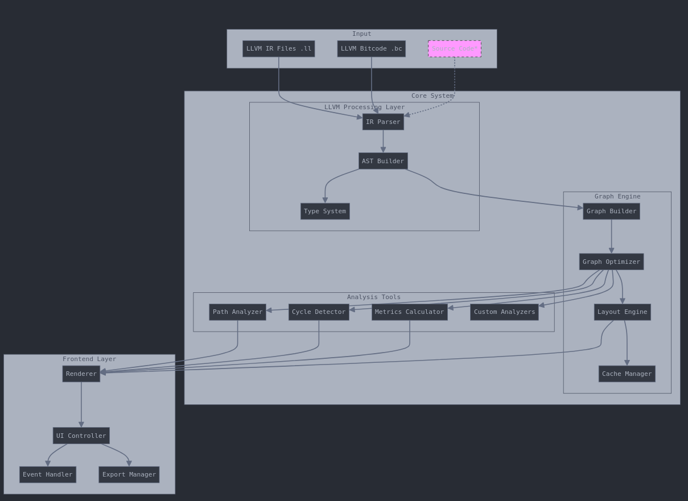
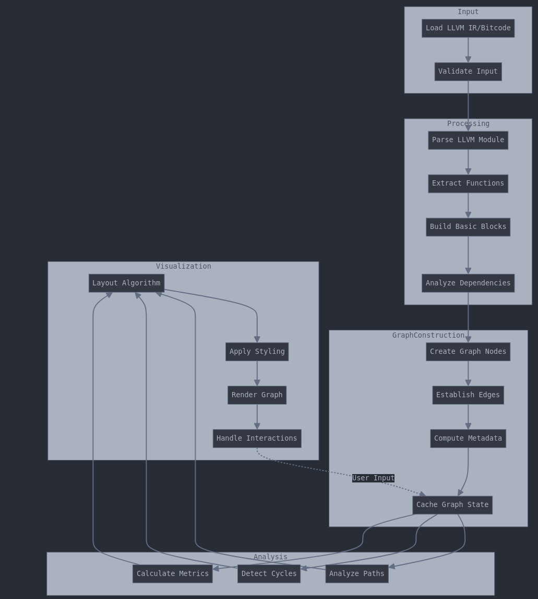
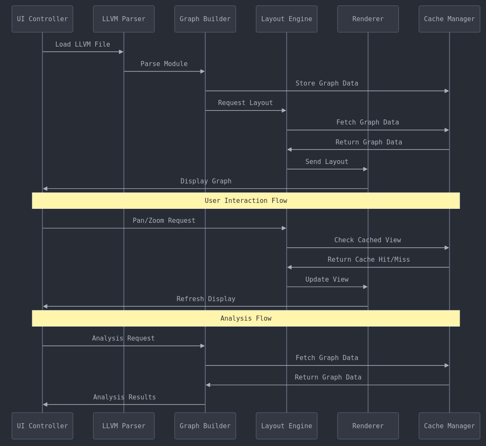
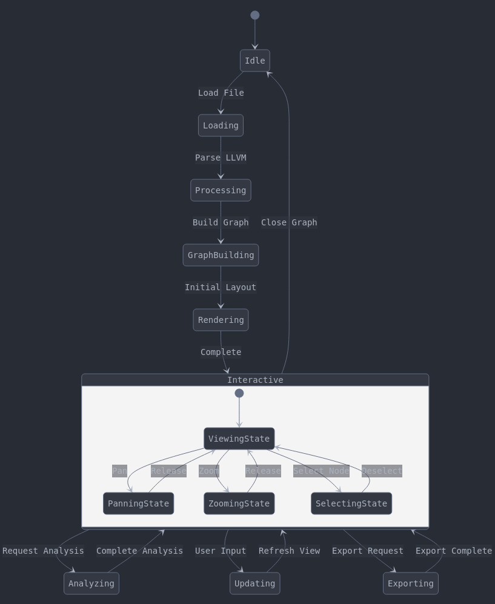

# LLVM Graph Visualization Tool

## Project Overview

A desktop application for Linux (Debian) written in Rust that focuses on visualizing control flow and dependency graphs from LLVM IR and bitcode files.

## Claude Chat

![https://claude.ai/chat/5a5290b5-3e68-41fb-bd01-5ef6d6b3dbf0][Here]

https://claude.ai/chat/5a5290b5-3e68-41fb-bd01-5ef6d6b3dbf0

## Input Types

- LLVM IR files (.ll)
- LLVM Bitcode files (.bc)
- Source code (future extension)

## Output/Visualization Types

- Control Flow Graphs (CFG) at function level
- Call Graphs at module level
- Data Dependency Graphs
- Dominator Trees
- Custom graph overlays (e.g., highlighting optimization opportunities)

## Core Features

- Load and parse LLVM IR/Bitcode
- Convert LLVM structures to internal graph representation
- Interactive visualization
- Graph layout optimization
- Export/Save capabilities
- Basic analysis tools (e.g., path finding, cycle detection)

## Architecture Overview

### Core Layers

```
[Input Layer]
    ↓
[LLVM Processing Layer]
    ↓
[Graph Representation Layer]
    ↓
[Visualization Layer]
    ↓
[UI Layer]
```

### System Architecture Diagram



### Data Flow Diagram



### Component Interaction Diagram



### Visualization States



## Main Components

### LLVM Interface Module

- IR/Bitcode parsing
- LLVM structure traversal
- Type system handling
- Metadata extraction

### Graph Engine

- Internal graph representation
- Graph algorithms
- Layout optimization
- Caching mechanisms

### Visualization Engine

- Rendering system
- Layout management
- User interaction handling
- Export functionality

### Analysis Tools

- Path analysis
- Cycle detection
- Optimization suggestions
- Metrics calculation

## Data Flow

```
[LLVM IR/Bitcode] → [Parser] → [Internal Graph] → [Layout Engine] → [Renderer]
                                     ↑↓
                              [Analysis Tools]
```

## Technical Decisions

### Performance Considerations

- Lazy loading for large modules
- Incremental graph updates
- View-dependent detail levels
- Caching strategies for graph layouts

### Extension Points

- Custom graph analyzers
- Additional input formats
- Visualization plugins
- Export formats
- Analysis passes

### Graph Library

- Using `petgraph` for core graph algorithms
- Custom wrappers for LLVM-specific functionality

### GUI Framework Options

- Iced: Native look, good performance
- Egui: Immediate mode, easier to prototype
- GTK-rs: More mature, but heavier

### Serialization

- For graph layouts
- For analysis results
- For user preferences

## Testing Strategy

- Unit tests for graph algorithms
- Integration tests with sample LLVM IR
- Performance benchmarks
- Visual regression tests

## Key Architectural Decisions

### Separation of Concerns

- Clear boundaries between LLVM processing, graph management, and visualization
- Independent analysis tools that can be extended
- Modular frontend components

### Data Management

- Centralized cache management
- Efficient state transitions
- Clear data flow paths

### Extensibility

- Plugin architecture for analyzers
- Multiple input format support
- Flexible visualization pipeline

### User Interaction

- Responsive UI state management
- Efficient update cycles
- Clear interaction patterns

## Dependencies

```toml
[dependencies]
# LLVM bindings
inkwell = { git = "https://github.com/TheDan64/inkwell", branch = "master", features = ["llvm16-0"] }

# Error handling
thiserror = "1.0"
anyhow = "1.0"

# Logging
log = "0.4"
env_logger = "0.10"

# Graph data structures
petgraph = "0.6"

[dev-dependencies]
criterion = "0.5"
pretty_assertions = "1.3"
```

## Project Structure

```
src/
├── main.rs                 # Application entry point
├── lib.rs                  # Library root and public API
│
├── project/                # Project analysis and build system integration
│   ├── mod.rs             # Module definition and public interface
│   ├── cmake.rs           # CMake project handling
│   ├── make.rs            # Makefile project handling
│   ├── compiler.rs        # Compiler command handling
│   └── config.rs          # Project configuration
│
├── llvm/                   # LLVM integration
│   ├── mod.rs             # Module definition
│   ├── context.rs         # LLVM context management
│   ├── module.rs          # LLVM module handling
│   ├── analysis/          # Analysis passes
│   │   ├── mod.rs
│   │   ├── control_flow.rs
│   │   ├── data_flow.rs
│   │   └── call_graph.rs
│   └── types.rs           # LLVM type system abstractions
│
├── graph/                  # Graph construction and manipulation
│   ├── mod.rs             # Module definition
│   ├── builder.rs         # Graph construction
│   ├── node.rs            # Node implementations
│   ├── edge.rs            # Edge implementations
│   ├── layout/            # Layout algorithms
│   │   ├── mod.rs
│   │   ├── force.rs       # Force-directed layout
│   │   └── hierarchical.rs # Hierarchical layout
│   └── transform.rs       # Graph transformations
│
├── viz/                    # Visualization
│   ├── mod.rs             # Module definition
│   ├── renderer.rs        # Rendering engine
│   ├── window.rs          # Window management
│   ├── interaction.rs     # User interaction handling
│   ├── camera.rs          # View management
│   └── style.rs           # Visual styling
│
├── util/                   # Utility functions
│   ├── mod.rs
│   ├── geometry.rs        # Geometric calculations
│   └── algorithms.rs      # Common algorithms
│
└── error/                  # Error handling
    ├── mod.rs             # Error types and handling
    └── conversion.rs      # Error conversion traits

tests/
├── integration/           # Integration tests
│   ├── project_tests.rs
│   ├── llvm_tests.rs
│   ├── graph_tests.rs
│   └── viz_tests.rs
│
└── fixtures/             # Test fixtures
    ├── cmake_project/
    ├── make_project/
    └── ir_samples/

benches/                  # Performance benchmarks
├── graph_benches.rs
└── layout_benches.rs

examples/                 # Usage examples
├── basic_cfg.rs          # Control Flow Graph example
├── call_graph.rs         # Call Graph example
└── data_flow.rs          # Data Flow Graph example

docs/                     # Documentation
├── architecture.md       # Architecture documentation
├── algorithms.md         # Algorithm documentation
└── api.md               # API documentation
```

## Installation Requirements

### LLVM 16 Setup on Debian

```bash
# Add LLVM repository
wget https://apt.llvm.org/llvm.sh
chmod +x llvm.sh
sudo ./llvm.sh 16

# Install LLVM 16 development packages
sudo apt-get install llvm-16-dev libclang-16-dev

# Make LLVM 16 the default version (optional)
sudo update-alternatives --install /usr/bin/llvm-config llvm-config /usr/bin/llvm-config-16 100
```

## Contributing

[To be added - contribution guidelines, code style, PR process]

## License

[To be added - license information]